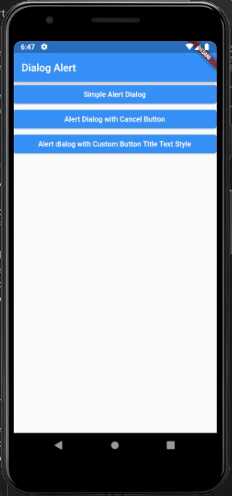

A new Flutter package for showing native alert view in ios and native alert dialog in android.

## Features

Android                   |  IOS
:-------------------------:|:-------------------------:
  |  


## Usage

Simple Alert Dialog:

```dart
showDialogAlert(
context: context,
title: 'Success',
message: 'You have successfully updated your profile.',
actionButtonTitle: 'OK',
);
```
Alert Dialog with Cancel Button

```dart
final result = await showDialogAlert(
  context: context,
  title: 'Message',
  message: 'Do you want to upload your profile picture?',
  actionButtonTitle: 'Upload',
  cancelButtonTitle: 'Cancel',
);
```
Alert dialog with Custom Button Title Text Style

```dart
final result = await showDialogAlert(
context: context,
title: 'Success',
message: 'You have successfully uploaded',
actionButtonTitle: 'Submit',
cancelButtonTitle: 'Cancel',
actionButtonTextStyle: const TextStyle(
color: Colors.green,
),
cancelButtonTextStyle: const TextStyle(
color: Colors.pink,
),
);
```

## Example

```dart
import 'package:dialog_alert/show_dialog_alert.dart';
import 'package:flutter/material.dart';

class AlertPage extends StatelessWidget {
  const AlertPage({Key? key}) : super(key: key);

  @override
  Widget build(BuildContext context) {
    return Scaffold(
      appBar: AppBar(
        title: const Text('Dialog Alert'),
      ),
      body: SafeArea(
        child: ListView(
          children: [
            ElevatedButton(
              child: const Text('Simple Alert Dialog'),
              onPressed: () {
                showDialogAlert(
                  context: context,
                  title: 'Success',
                  message: 'You have successfully updated your profile.',
                  actionButtonTitle: 'OK',
                );
              },
            ),
            ElevatedButton(
              child: const Text('Alert Dialog with Cancel Button'),
              onPressed: () async {
                final result = await showDialogAlert(
                  context: context,
                  title: 'Message',
                  message: 'Do you want to upload your profile picture?',
                  actionButtonTitle: 'Upload',
                  cancelButtonTitle: 'Cancel',
                );
              },
            ),
            ElevatedButton(
              child: const Text(
                  'Alert dialog with Custom Button Title Text Style'),
              onPressed: () async {
                final result = await showDialogAlert(
                  context: context,
                  title: 'Success',
                  message: 'You have successfully uploaded',
                  actionButtonTitle: 'Submit',
                  cancelButtonTitle: 'Cancel',
                  actionButtonTextStyle: const TextStyle(
                    color: Colors.green,
                  ),
                  cancelButtonTextStyle: const TextStyle(
                    color: Colors.pink,
                  ),
                );
              },
            ),
          ],
        ),
      ),
    );
  }
}
```
